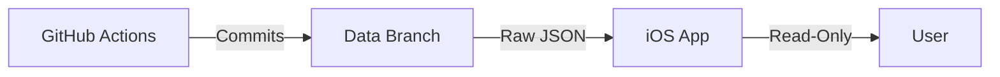

# Stage 4: Mobile Dashboard (Read-Only)

**Status**: IN PROGRESS  
**Goal**: Provide a native iOS interface for viewing WatchDog results.

---

## 1. Architecture

Stage 4 interacts with Stage 3 via **Uni-directional Data Flow**.

-   **Source**: `data/users/{User}/results_{User}.json` (on `data` branch).
-   **Transport**: HTTPS (GET) via `raw.githubusercontent.com`.
-   **Auth**: Public (Read-Only) for pilot. No tokens required.

## 2. Constraints

-   **Read-Only**: The app CANNOT modify products.
-   **No Push**: The app relies on Pull-to-Refresh.
-   **No Auth**: The app hardcodes the Pilot User ID (`MonMar`).

## 3. Technology Stack

-   **Language**: Swift 6
-   **UI Framework**: SwiftUI
-   **Concurrency**: async/await
-   **Pattern**: MVVM (Model-View-ViewModel)

## 4. Implementation Status

| Component | Status | Description |
| :--- | :--- | :--- |
| **Skeleton** | ✅ DONE | `WatchDogApp.swift`, directory structure. |
| **Networking** | ✅ DONE | `NetworkManager` fetching raw JSON. |
| **Models** | ✅ DONE | `ProductResult` Codable struct. |
| **UI** | ✅ DONE | Basic List View with color-coded verdicts. |
| **Push Notif** | 📅 PLANNED | Future phase (Stage 4.1). |

---

## 5. Next Steps

1.  Open the project in Xcode.
2.  Verify JSON decoding on a real device/simulator.
3.  Refine UI/UX (App Icon, Loading States).
